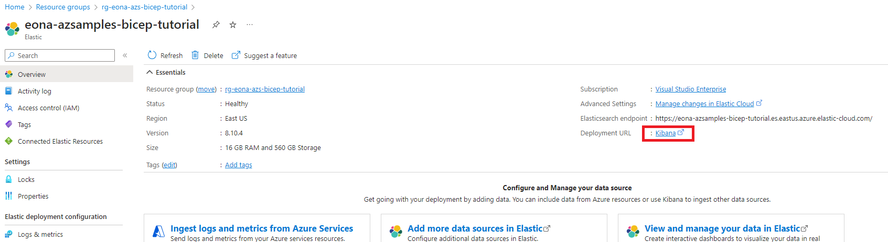
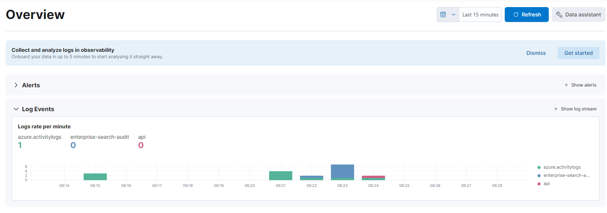

# Bicep Authoring Devcontainer
This is a simple devcontainer that is a fork and rename of [vscode-remote-try-bicep](https://github.com/Azure/vscode-remote-try-bicep).  This devcontainer demonstrates how to deploy [Elastic Cloud on Azure](https://azuremarketplace.microsoft.com/en-us/marketplace/apps/elastic.ec-azure-pp?tab=overview) using bicep.  The code can be used with CodeSpaces or VSCode Remote to get all the tooling needed to start authoring bicep.

## Caveat
Elastic Cloud on Azure is an [Azure Native ISV Service](https://learn.microsoft.com/en-us/azure/partner-solutions/overview) and although the Microsoft.Elastic monitors resource provider is documented in the [official](https://learn.microsoft.com/en-us/azure/templates/microsoft.elastic/monitors?pivots=deployment-language-bicep) bicep documentation, it is not fully supported.  Also, before deploying Elastic Cloud on Azure, please take a look at [Elastic Cloud pricing](https://www.elastic.co/pricing) as you could incur costs when deploying Elastic Cloud on Azure.


## Prerequisites
1. [An Azure subscription](https://azure.microsoft.com/) & the proper azure [role](https://learn.microsoft.com/en-us/azure/role-based-access-control/built-in-roles) to deploy Elastic Cloud
1. [An Elastic Cloud account](https://www.elastic.co/)

## Bicep Parameters
1. location: Azure Region *(default: eastus)*.
1. monitorName: Elastic Search monitor name *(default: eona-azsamples-bicep-tutorial)*.
1. firstName: User first name *(required)*.
1. lastName: User last name *(required)*.
1. emailAddress: User email address *(required)*.
1. country: User country *(default: US)*.
1. domain: Azure AD domain *(required)*.
1. sku: Elastic Search monitor sku *(required)*.
1. version: Elastic Search monitor version *(default: 8.10.4)*.

**Note:** For the purpose of this demo, the Elastic Monitor Tag Rules were intentionally hardcoded.  Please feel free to modify for your specific needs.
- sendAadLogs: false
- sendActivityLogs: true
- sendSubscriptionLogs: true

## Quick Start: VSCode Remote
1. Clone the repository.
1. Configure the development environment by installing VSCode and the "Remote - Containers" extension. [Quick start docs here](https://code.visualstudio.com/docs/remote/containers-tutorial).
1. Open the repository in VSCode
1. [`CTRL+SHIFT+P` then type `Reopen in container`](https://code.visualstudio.com/docs/remote/containers#_getting-started) to open the devcontainer in VSCode.
1. [Open a terminal in VSCode with `CTRL+SHIFT+P` -> `Terminal: Create new integrated terminal`](https://code.visualstudio.com/docs/remote/containers#_opening-a-terminal). We'll use this to run Bicep commands.
1. [Run `az login`](https://docs.microsoft.com/en-us/cli/azure/authenticate-azure-cli) from the VSCode terminal to connect to your Azure account.
1. Run the following to create a resource group and deploy your Bicep file to it *(Note: deployment of an Elastic Cloud cluster can take several minutes)*.
    ```sh
    az group create -n <resource-group> -l <region> 
    az deployment group create -f ./main.bicep -g <resource-group> \
    -p firstName=<fname> lastName=<lname> emailAddress=<email> domain=<azuread-domain>
    ```
1. Open [main.bicep](./main.bicep) in to modify the resources you want to deploy, and re-run the `az deployment group` command to re-deploy the resources.

## Quick Start: Codespaces
1. Open this repository in [GitHub Codespaces](https://github.com/features/codespaces).
1. Open a terminal in VSCode with `CTRL+J`. We'll use this to run Bicep commands.
1. [Run `az login`](https://docs.microsoft.com/en-us/cli/azure/authenticate-azure-cli) from the VSCode terminal to connect to your Azure account.
1. Run the following to create a resource group and deploy your Bicep file to it *(Note: deployment of an Elastic Cloud cluster can take several minutes)*.
    ```sh
    az group create -n <resource-group> -l <region> 
    az deployment group create -f ./main.bicep -g <resource-group> \
    -p firstName=<fname> lastName=<lname> emailAddress=<email> domain=<azuread-domain>
    ```
1. Open [main.bicep](./main.bicep) in your Codespaces window to modify the resources you want to deploy, and re-run the `az deployment group` command to re-deploy the resources.

## Next Steps
1. Log into the Azure Portal and find the Elastic Cloud resource you created and click the *Kibana* link to log into Elastic Cloud.

1. In Kibana, select *Observability*
1. Under *Log Events*, view the logging data Elastic Cloud on Azure has captured.



## Clean Up
```ssh
az group delete -n <resource-group> -y
```

## Misc.

Review [the Bicep documentation](https://docs.microsoft.com/en-us/azure/azure-resource-manager/bicep/overview) to build out more advanced scenarios.

## Contributing

This project welcomes contributions and suggestions.  Most contributions require you to agree to a
Contributor License Agreement (CLA) declaring that you have the right to, and actually do, grant us
the rights to use your contribution. For details, visit https://cla.opensource.microsoft.com.

When you submit a pull request, a CLA bot will automatically determine whether you need to provide
a CLA and decorate the PR appropriately (e.g., status check, comment). Simply follow the instructions
provided by the bot. You will only need to do this once across all repos using our CLA.

This project has adopted the [Microsoft Open Source Code of Conduct](https://opensource.microsoft.com/codeofconduct/).
For more information see the [Code of Conduct FAQ](https://opensource.microsoft.com/codeofconduct/faq/) or
contact [opencode@microsoft.com](mailto:opencode@microsoft.com) with any additional questions or comments.
